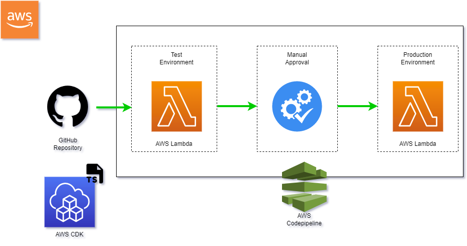

# Welcome to CI/CD With AWS CodePipeline
## How To Create a Deployment Pipeline for a CDK App Using AWS CodePipeline and GitHub

This code was copied and updated from Pawara Siriwardhane GitHub and Medium article. I made some changes to add in a config.json file to centralise basic setup for reusability. Also added was the code to allow AWS Secrets Manager to hold the GitHub auth-tokens.

Pawara Siriwardhane GitHub: https://github.com/aLLUPS/aws-cdk-codepipeline-public

Medium article link: https://pawara73.medium.com/ci-cd-with-aws-codepipeline-a452c5b88c60

<table>
    <tr>
        <th> Project architecture</th>
    </tr>
    <tr>
        <td></td>
    </tr>
</table>

## Useful commands

1. Download and install AWS CLI  
   https://docs.aws.amazon.com/cli/v1/userguide/install-windows.html#install-msi-on-windows

2. Install cdk
    - `npm i aws-cdk@2.20.0`

3. To configure the AWS Account and CDK:  
    - To create Iam User: https://cdkworkshop.com/15-prerequisites/200-account.html#administrator-user 
    - To configure the AWS credentials: https://cdkworkshop.com/15-prerequisites/200-account.html#configure-your-credentials

### After cloning the repo:

1. Install node modules:
    - `npm install`

2. Modify the following files according to the comments given.
    - Enter details to config.json (this eliminates the need to edit the next two files, unless required for your use case.)
    - aws-codepipeline-project.ts
    - aws-codepipeline-project-stack.ts

3. Perform a git init, creat new repo and link with new git repo.
    - Create an new repo in GitHub.
    - `git init`
    - `git remote add origin git@github.com:[GIT OWNER]/[REPO NAME].git`
    - `git add *`
    - `git commit -m "initial commit"`
    - `git push -u origin master`

4. To bootstrap the environment (to create cdk.out):
    - `cdk bootstrap`

    (it maybe required to perform the following to bootstrap the test & prod accounts, perform for each account.)
    - `env CDK_NEW_BOOTSTRAP=1 npx cdk bootstrap \
        --profile default \
        --cloudformation-execution-policies arn:aws:iam::aws:policy AdministratorAccess \
        --trust [TEST_or_PROD_A/C_NUMBER]\
        aws://[MAIN_A/C_NUMBER]/[REGION]`

5. To deploy the pipeline: (This is only required to be performed once)
    - `cdk deploy`

### Tear down

- NOTE: This could have the potential to destroy the Test and Prod accounts if account restrictions have not been put in place.
    - `cdk destoy`

### Next to do
- Add local dev stage deployment option
- Add CDK Amplify code for frontend CI/CD pipeline to stack
- Add example code for AppSync/RestAPI into stack

(Most likely many other base code examples will also be added to the stack.)